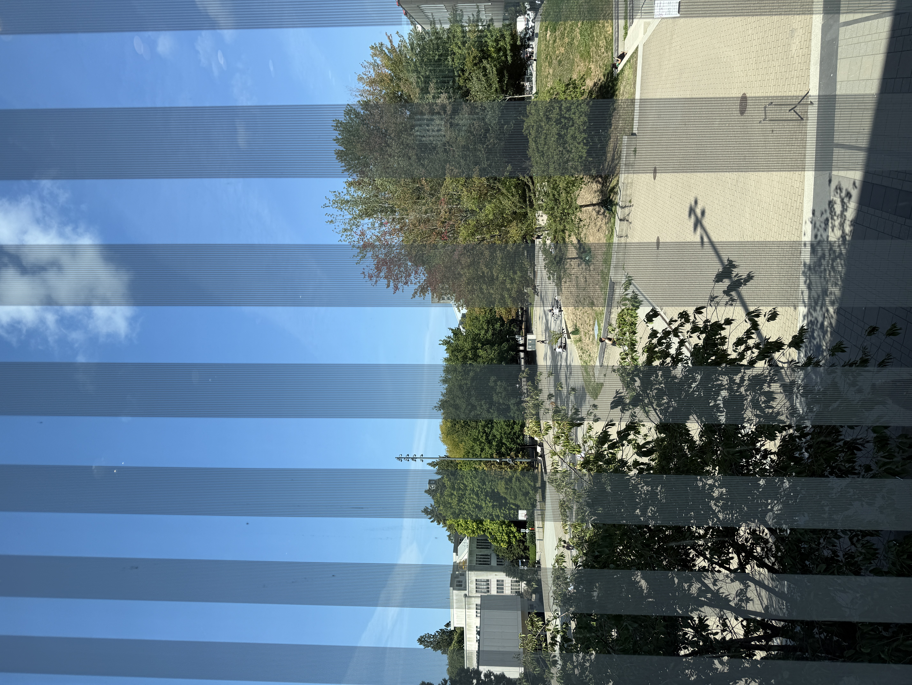

Orientation was an amazing start to the program, offering a warm introduction to our supportive faculty and staff. 
It served as a wonderful icebreaker, giving us a great opportunity to start connecting with our new peers. 
While I didn't get a chance to meet everyone in the cohort yet, every single person I spoke with was incredibly friendly and welcoming. 
Looking out from our orientation room on a sunny day, surrounded by a stunning view of the UBC campus, I felt truly excited for the journey ahead.

Walking into my very first class, concepts like navigating the terminal, running `git clone`, or launching JupyterLab using `uv` were completely new to me. 
Fortunately, the classmates sitting next to me stepped in without hesitation to guide me through the commands, and I am genuinely grateful for their kindness. 
What surprised me most was the incredible patience and dedication of the teaching staff, who thoughtfully answered every single question from students coming from all different academic backgrounds.

Stepping into such an intensive program can be intimidating, but the supportive environment here has made all the difference. 
Knowing that I am surrounded by approachable instructors, patient TAs, and helpful peers gives me immense peace of mind. 
I am heading into the rest of the term feeling capable, motivated, and confident in navigating this fast-paced learning journey.

{width=400px}
